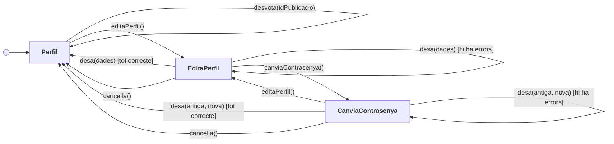
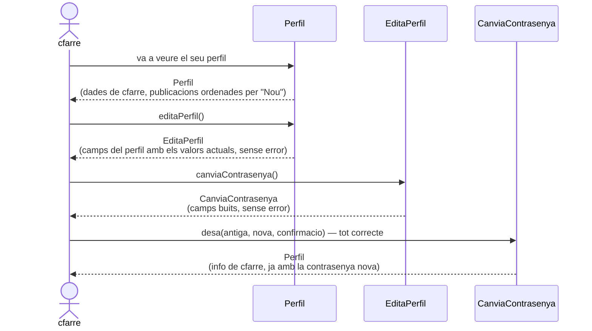
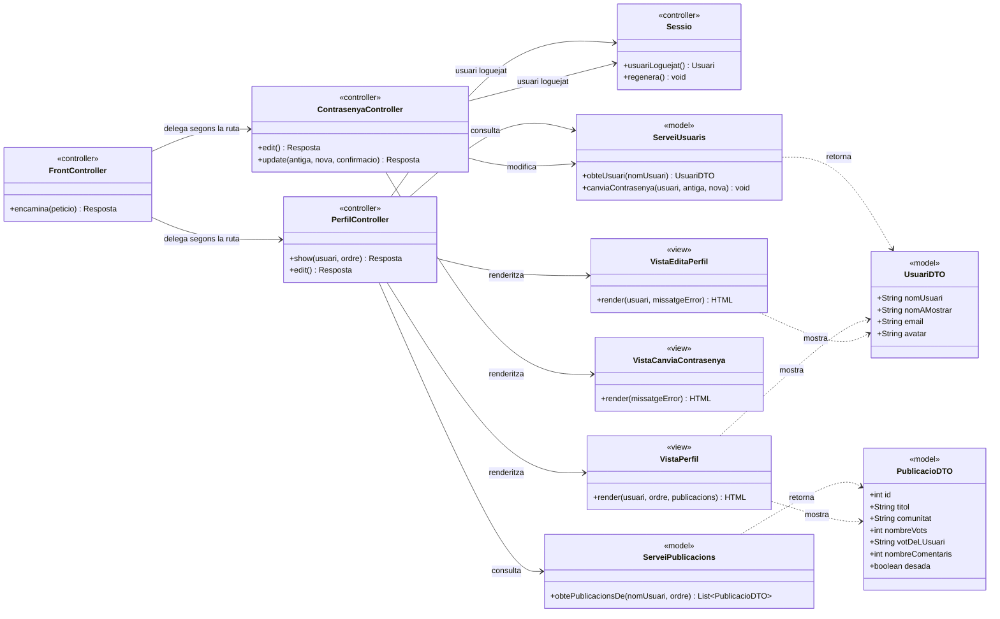
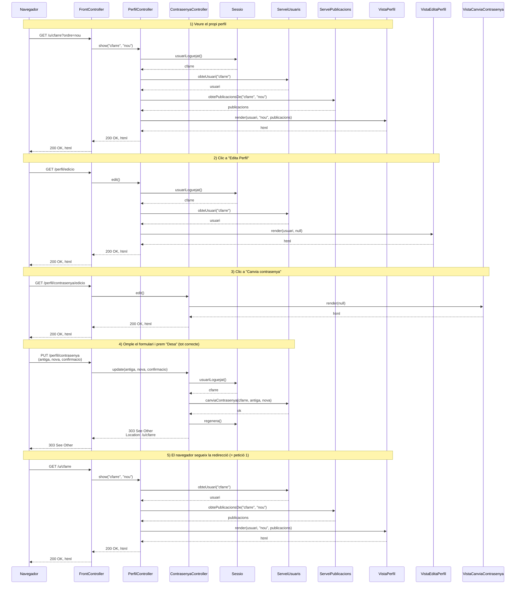

# Solució — Primer Control ASW (dimarts, 4 de novembre de 2025)

Exercici (7 punts) — **programming.dev simplificat**: UX Model i Disseny Intern.

Enunciat original: [`202526q1_control_1.pdf`](202526q1_control_1.pdf)

Suposicions generals:

- L'usuari (p. ex. `cfarre`) ja està loguejat; la sessió manté la seva
  identitat, de manera que les pàgines d'edició del propi perfil no necessiten
  cap identificador d'usuari a la URL.
- Cada publicació té un **identificador intern** (`id`) que no es mostra però
  que viatja a les URLs i als formularis.
- Les accions no descrites queden fora de l'abast: clicar l'estel per desar una
  publicació, clicar el comptador de comentaris, entrar a la comunitat
  "Programming", logout, etc. Només se'n mostra l'estat.
- El criteri d'ordenació per defecte és "Nou".

---

## a) [2 punts] Diagrama de flux de navegació (*screens and navigational paths*)

### Diagrama

`Perfil` és la pantalla inicial. Fixeu-vos que `EditaPerfil` i
`CanviaContrasenya` estan connectades **en els dos sentits**: des de l'edició
del perfil es va al canvi de contrasenya i des del canvi de contrasenya es pot
tornar a l'edició del perfil.

### Contingut i operacions de cada screen

#### Screen `Perfil`

Mostra el perfil de l'usuari loguejat i el llistat de les seves publicacions.

**Informació que conté**

| Dada | Descripció |
| --- | --- |
| `usuari` | Avatar, nom d'usuari (`cfarre`), nom a mostrar i la resta de dades del perfil |
| `criteriOrdenacio` | Quin dels tres criteris està seleccionat: "Nou", "Antic" o "Més puntuat" |
| `publicacions` | Llistat de publicacions de l'usuari, ordenat segons `criteriOrdenacio` |

De cada publicació del llistat:

| Dada | Descripció |
| --- | --- |
| `id` | Identificador intern, no visible |
| `titol` | Títol de la publicació |
| `comunitat` | Nom de la comunitat (p. ex. "Programming") i el seu avatar |
| `nombreVots` | Recompte de vots que es mostra entre les dues fletxes |
| `votDeLUsuari` | `cap`, `positiu` o `negatiu`; és el que determina quina fletxa es pinta de blau i quina de gris |
| `nombreComentaris` | Número que apareix al costat de la icona de comentaris |
| `desada` | Si l'usuari l'ha desada (estel groc) o no (estel blanc) |

**Operacions**

| Operació | Efecte |
| --- | --- |
| `ordena(criteri)` | Torna a mostrar aquesta mateixa screen amb el llistat ordenat pel criteri triat |
| `vota(idPublicacio, sentit)` | Clic sobre una fletxa **grisa**. Registra el vot (`positiu` o `negatiu` segons la fletxa), i si l'usuari tenia el vot contrari, el substitueix. Torna a mostrar aquesta screen amb la fletxa en blau, la contrària en gris i el recompte actualitzat |
| `desvota(idPublicacio)` | Clic sobre una fletxa **blava**. Retira el vot de l'usuari. Torna a mostrar aquesta screen amb aquella fletxa en gris i el recompte actualitzat |
| `editaPerfil()` | Va a `EditaPerfil` |

#### Screen `EditaPerfil`

Formulari per modificar part de la informació de l'usuari loguejat.

**Informació que conté**

| Dada | Descripció |
| --- | --- |
| `camps` | Valors actuals dels camps editables del perfil (nom a mostrar, email, ...) |
| `missatgeError` | Missatge d'error, si l'últim intent de desar va fallar (p. ex. l'email ja existeix). Es col·loca **just abans de "Nom a mostrar"** |

En cas d'error es torna a mostrar la pàgina **conservant els valors introduïts**
per l'usuari, perquè els pugui corregir sense tornar-los a escriure.

**Operacions**

| Operació | Efecte |
| --- | --- |
| `desa(dades)` | Si hi ha algun error → torna a `EditaPerfil` amb el missatge. Si no → actualitza les dades i va a `Perfil` |
| `canviaContrasenya()` | Va a `CanviaContrasenya` |
| `cancella()` | Va a `Perfil` sense desar cap canvi |

#### Screen `CanviaContrasenya`

Formulari per canviar la contrasenya de l'usuari loguejat.

**Informació que conté**

| Dada | Descripció |
| --- | --- |
| `camps` | Contrasenya antiga i contrasenya nova (amb la seva confirmació) |
| `missatgeError` | Missatge d'error, si l'últim intent va fallar (p. ex. la contrasenya antiga no és correcta). Es col·loca **just abans de "Contrasenya nova"** |

Diferència important respecte de `EditaPerfil`: quan hi ha un error, aquesta
pàgina es torna a mostrar amb **tots els camps buits**. Té sentit — són
contrasenyes, no s'han de retenir ni mostrar.

**Operacions**

| Operació | Efecte |
| --- | --- |
| `desa(antiga, nova, confirmacio)` | Si hi ha algun error → torna a `CanviaContrasenya` amb el missatge i els camps buits. Si no → enregistra la contrasenya nova i va a `Perfil` |
| `editaPerfil()` | Va a `EditaPerfil` |
| `cancella()` | Va a `Perfil` sense canviar res |

---

## b) [1 punt] Diagrama d'escenari d'interacció (*storyboard sequence*)

Escenari: l'usuari loguejat va a veure el seu perfil i després decideix canviar
la seva contrasenya, cosa que fa amb èxit.

Cal passar per `EditaPerfil`: l'enllaç "Canvia contrasenya" només hi és en
aquella pàgina, no a `Perfil`. Com que l'escenari diu "amb èxit", no es recorre
cap dels camins de retorn amb missatge d'error.

---

## c) [2 punts] Diagrama de classes del disseny intern (capa de presentació, MVC)

Abast: només l'escenari de l'apartat b).

### Rutes implicades en l'escenari

| # | Petició HTTP | Controlador :: acció | Resultat |
| --- | --- | --- | --- |
| 1 | `GET /u/cfarre?ordre=nou` | `PerfilController::show` | Renderitza `VistaPerfil` |
| 2 | `GET /perfil/edicio` | `PerfilController::edit` | Renderitza `VistaEditaPerfil` |
| 3 | `GET /perfil/contrasenya/edicio` | `ContrasenyaController::edit` | Renderitza `VistaCanviaContrasenya` |
| 4 | `PUT /perfil/contrasenya` (cos: `antiga`, `nova`, `confirmacio`) | `ContrasenyaController::update` | Canvia la contrasenya i redirigeix (303) a la ruta 1 |

Notes de disseny:

- Les peticions 1, 2 i 3 són **segures** (només mostren informació): `GET`. La 4
  modifica l'estat de l'usuari: `PUT`. Com que els formularis HTML només envien
  `GET` i `POST`, a la pràctica es fa amb un `POST` i un camp ocult
  `_method=PUT` que el *front controller* interpreta.
- Les contrasenyes viatgen **al cos** de la petició, mai a la URL: una URL queda
  a l'historial del navegador, als logs del servidor i a la capçalera `Referer`.
- Les rutes 2 i 3 no porten el nom d'usuari: sempre editen el perfil de **qui té
  la sessió oberta**. Si portessin un identificador caldria comprovar a cada
  petició que coincideix amb l'usuari loguejat, o qualsevol podria editar el
  perfil d'un altre canviant la URL.
- Després de canviar la contrasenya s'aplica **POST/Redirect/GET**: es respon
  `303 See Other` cap a `GET /u/cfarre`, de manera que recarregar la pàgina no
  reintenta el canvi.

### Diagrama de classes

### Repartiment de responsabilitats MVC

- **Controlador** (`FrontController`, `PerfilController`, `ContrasenyaController`):
  rep la petició HTTP, n'extreu els paràmetres, consulta qui és l'usuari
  loguejat, decideix quina operació del model cal invocar i quina vista s'ha de
  renderitzar (o si cal redirigir). No comprova contrasenyes ni genera HTML.
- **Model** (`ServeiUsuaris`, `ServeiPublicacions` i els DTOs): és la **façana de
  la capa de domini** vista des de la presentació. Conté les regles de negoci
  —validar la contrasenya antiga, comprovar que l'email no estigui repetit,
  ordenar les publicacions— i és independent d'HTTP.
- **Vista** (`VistaPerfil`, `VistaEditaPerfil`, `VistaCanviaContrasenya`):
  genera l'HTML a partir de les dades que li passa el controlador. Entre altres
  coses, és qui decideix pintar cada fletxa de blau o de gris a partir de
  `votDeLUsuari`, i l'estel de groc o de blanc a partir de `desada`.

> **Fora de l'escenari b)** — per cobrir tota la funcionalitat de l'apartat a)
> caldria afegir `PerfilController::update` (`PUT /perfil`) sobre
> `VistaEditaPerfil`, i un `VotsController` amb
> `POST /publicacions/{id}/vot` (votar, amb el sentit al cos) i
> `DELETE /publicacions/{id}/vot` (desvotar). L'ordenació no necessita cap acció
> nova: és la mateixa ruta 1 amb un altre valor d'`ordre`.

---

## d) [2 punts] Diagrama de seqüència del disseny intern (capa de presentació)

Escenari de l'apartat b). Quatre peticions HTTP; l'última acaba amb una
redirecció que provoca una cinquena petició, idèntica a la primera.

### Observacions

- **POST/Redirect/GET**: la petició 4 no renderitza cap vista; respon amb
  `303 See Other`. Així una recàrrega del navegador no reenvia el canvi de
  contrasenya, i la URL on acaba l'usuari (`/u/cfarre`) és compartible.
- **La validació la fa el model**: qui comprova que la contrasenya antiga és
  correcta és `ServeiUsuaris.canviaContrasenya`, no el controlador. És una regla
  de negoci. Si fallés, el model llançaria una excepció i el controlador
  renderitzaria `VistaCanviaContrasenya` amb el missatge d'error i **els camps
  buits** (camí que aquest escenari no recorre).
- **`Sessio.regenera()`**: en canviar la contrasenya convé regenerar
  l'identificador de sessió. Si no, una sessió robada abans del canvi
  continuaria sent vàlida després (*session fixation*). No ho demana l'enunciat,
  però és la mena de detall que enllaça amb el tema 6.
- La petició 3 no toca el model: només ha de mostrar un formulari buit. Per això
  `ContrasenyaController::edit` va directament a la vista.
