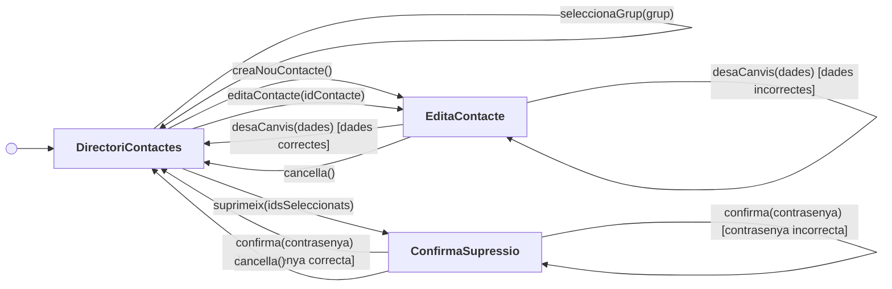
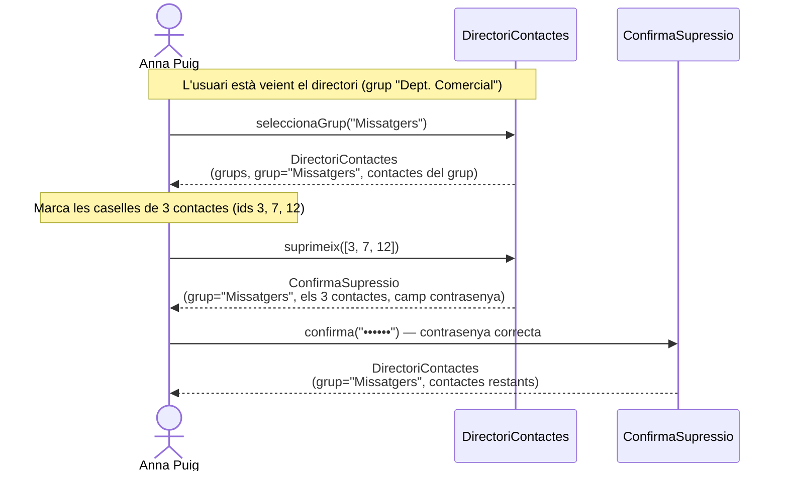
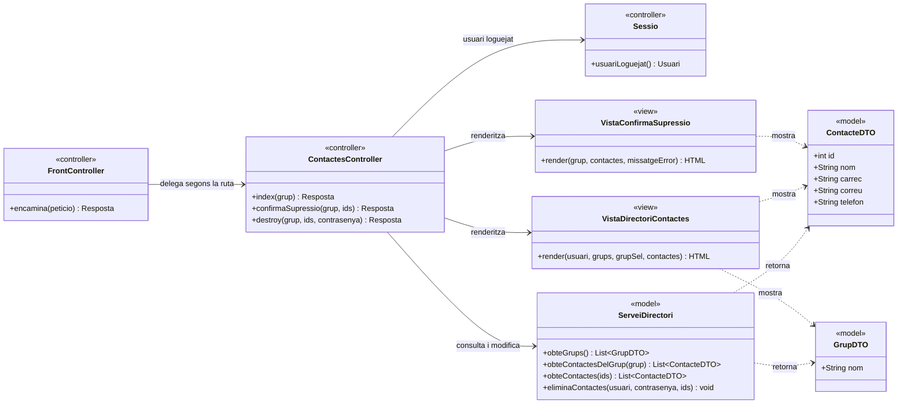
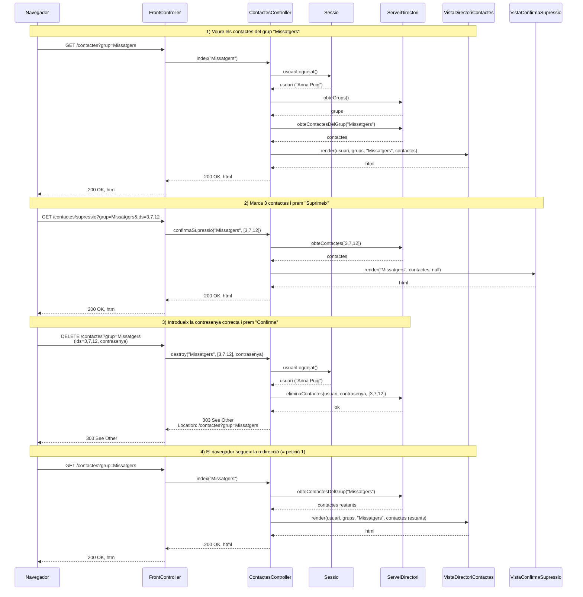

# Solució — Primer Control ASW (dimarts, 7 d'abril de 2026)

Exercici (7 punts) — **Directori de Contactes**: UX Model i Disseny Intern.

Enunciat original: [`202526q2_control_1.pdf`](202526q2_control_1.pdf)

Suposicions generals:

- L'usuari (p. ex. "Anna Puig") ja està loguejat; la sessió manté la seva
  identitat i, per tant, no cal passar-la per la URL.
- Cada contacte té un **identificador intern enter** (`id`), que no es mostra a
  l'usuari però que sí que viatja als formularis i a les URLs.
- Les accions no descrites a l'enunciat (logout, gestió de grups, cerca...)
  queden fora de l'abast.

---

## a) [2 punts] Diagrama de flux de navegació (*screens and navigational paths*)

### Diagrama

`DirectoriContactes` és la pantalla inicial.

### Contingut i operacions de cada screen

#### Screen `DirectoriContactes`

Mostra els contactes d'un grup i permet crear-ne, editar-ne i suprimir-ne.

**Informació que conté**

| Dada | Descripció |
| --- | --- |
| `usuariLoguejat` | Nom de l'usuari de la sessió (p. ex. "Anna Puig") |
| `grups` | Llista de tots els grups del directori (nom de cada grup) |
| `grupSeleccionat` | Grup del qual s'estan mostrant els contactes |
| `contactes` | Llista de contactes del grup seleccionat; de cadascun: `id` (intern, no visible), nom i dades de resum (càrrec, correu, telèfon...) |
| `seleccio` | Per a cada contacte, una casella que indica si està marcat |

**Operacions**

| Operació | Efecte |
| --- | --- |
| `seleccionaGrup(grup)` | Torna a mostrar aquesta mateixa screen amb els contactes de `grup` |
| `creaNouContacte()` | Va a `EditaContacte` amb el formulari buit |
| `editaContacte(idContacte)` | Va a `EditaContacte` amb les dades del contacte `idContacte` |
| `suprimeix(idsSeleccionats)` | Va a `ConfirmaSupressio` amb els contactes marcats |

#### Screen `EditaContacte`

Formulari per introduir un contacte nou o modificar-ne un d'existent.

**Informació que conté**

| Dada | Descripció |
| --- | --- |
| `grup` | Grup al qual pertany (o pertanyerà) el contacte |
| `idContacte` | Identificador intern del contacte; buit si és un contacte nou |
| `camps` | Valors actuals de cada camp del contacte (nom, cognoms, càrrec, correu, telèfon...), amb indicació de quins són obligatoris |
| `missatgeError` | Missatge d'error, si l'últim intent de desar va fallar (opcional) |
| `campsErronis` | Marca dels camps buits o incorrectes, per ressaltar-los |

Quan es torna a mostrar després d'un error, es **conserven els valors que no
eren ni buits ni incorrectes**.

**Operacions**

| Operació | Efecte |
| --- | --- |
| `desaCanvis(dades)` | Si hi ha camps obligatoris buits, errors de format o violacions d'integritat del domini → torna a `EditaContacte` amb l'error. Si tot és correcte → crea o actualitza el contacte i va a `DirectoriContactes` amb el seu grup |
| `cancella()` | Va a `DirectoriContactes` amb el grup, sense desar res |

#### Screen `ConfirmaSupressio`

Demana confirmació, amb contrasenya, abans d'eliminar els contactes marcats.

**Informació que conté**

| Dada | Descripció |
| --- | --- |
| `grup` | Grup dels contactes que s'eliminaran |
| `contactesAEliminar` | Llista dels contactes marcats: `id` (intern) i nom |
| `contrasenya` | Camp d'entrada per a la contrasenya de l'usuari loguejat |
| `missatgeError` | Missatge d'error si la contrasenya introduïda no era correcta (opcional) |

**Operacions**

| Operació | Efecte |
| --- | --- |
| `confirma(contrasenya)` | Si la contrasenya és incorrecta → torna a `ConfirmaSupressio` amb l'error. Si és correcta → elimina els contactes i va a `DirectoriContactes` amb la resta de contactes del grup |
| `cancella()` | Va a `DirectoriContactes` amb el grup, sense eliminar res |

---

## b) [1 punt] Diagrama d'escenari d'interacció (*storyboard sequence*)

Escenari: l'usuari loguejat va a veure els contactes del grup **"Missatgers"** i
elimina de cop **tres contactes**, encertant la contrasenya al primer intent.

Com que la contrasenya és correcta al primer intent, l'escenari no passa mai
pels camins de retorn a la mateixa screen amb missatge d'error.

---

## c) [2 punts] Diagrama de classes del disseny intern (capa de presentació, MVC)

Abast: només l'escenari de l'apartat b). Ruta inicial `GET /contactes?grup=Missatgers`.

### Rutes implicades en l'escenari

| # | Petició HTTP | Controlador :: acció | Resultat |
| --- | --- | --- | --- |
| 1 | `GET /contactes?grup=Missatgers` | `ContactesController::index` | Renderitza `VistaDirectoriContactes` |
| 2 | `GET /contactes/supressio?grup=Missatgers&ids=3,7,12` | `ContactesController::confirmaSupressio` | Renderitza `VistaConfirmaSupressio` |
| 3 | `DELETE /contactes?grup=Missatgers` (cos: `ids=3,7,12`, `contrasenya`) | `ContactesController::destroy` | Elimina i redirigeix (303) a la ruta 1 |

Notes de disseny:

- Les peticions 1 i 2 són **segures** (només llegeixen i mostren informació):
  s'implementen amb `GET`. La 3 modifica l'estat i s'implementa amb `DELETE`;
  com que els formularis HTML només envien `GET`/`POST`, a la pràctica es
  fa amb un `POST` i un camp ocult `_method=DELETE` que el *front controller*
  interpreta.
- La contrasenya viatja **al cos** de la petició, mai a la URL.
- Després d'eliminar s'aplica **POST/Redirect/GET**: es respon `303 See Other`
  cap a `GET /contactes?grup=Missatgers`, de manera que recarregar la pàgina no
  reintenta l'eliminació.

### Diagrama de classes

### Repartiment de responsabilitats MVC

- **Controlador** (`FrontController`, `ContactesController`): rep la petició
  HTTP, n'extreu i valida els paràmetres (`grup`, `ids`, `contrasenya`), decideix
  quina operació del model cal invocar i quina vista s'ha de renderitzar (o si
  cal redirigir). No conté lògica de negoci ni genera HTML.
- **Model** (`ServeiDirectori` + DTOs): és la **façana de la capa de domini**
  vista des de la presentació. Conté la lògica de negoci (comprovar la
  contrasenya, eliminar contactes) i és totalment independent d'HTTP.
- **Vista** (`VistaDirectoriContactes`, `VistaConfirmaSupressio`): genera l'HTML
  a partir de les dades que li passa el controlador. Només llegeix dades; no
  crida mai el model per modificar res.

> **Fora de l'escenari b)** — per completar tota la funcionalitat de l'apartat a)
> caldria afegir `ContactesController::nou`, `::edit`, `::create` i `::update`
> amb la vista `VistaEditaContacte` sobre les rutes
> `GET /contactes/nou?grup=…`, `GET /contactes/{id}/edicio`,
> `POST /contactes` i `PUT /contactes/{id}`.

---

## d) [2 punts] Diagrama de seqüència del disseny intern (capa de presentació)

Escenari de l'apartat b). Tres peticions HTTP consecutives (la tercera acaba
amb una redirecció que provoca una quarta petició, idèntica a la primera).

### Observacions

- **POST/Redirect/GET**: la petició 3 no renderitza cap vista; respon amb
  `303 See Other`. Això evita que una recàrrega del navegador reenviï
  l'eliminació i fa que la URL final (`/contactes?grup=Missatgers`) sigui
  compartible i marcable.
- **Autenticació de l'acció**: la verificació de la contrasenya la fa el
  **model** (`ServeiDirectori.eliminaContactes`), no el controlador: és una
  regla de negoci. Si fos incorrecta, el model llançaria una excepció i el
  controlador renderitzaria `VistaConfirmaSupressio` amb el missatge d'error
  (camí que aquest escenari no recorre).
- **Sense estat al servidor entre peticions**: els identificadors dels contactes
  a eliminar viatgen dins del formulari de `ConfirmaSupressio` (camps ocults),
  no es guarden a la sessió.
