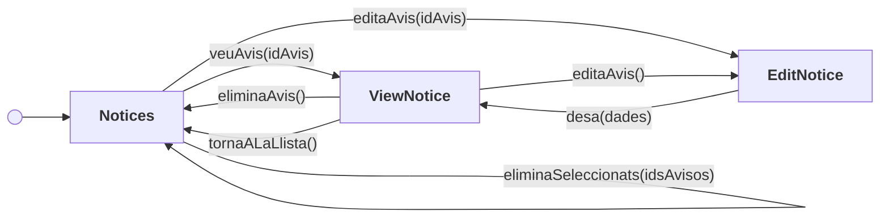
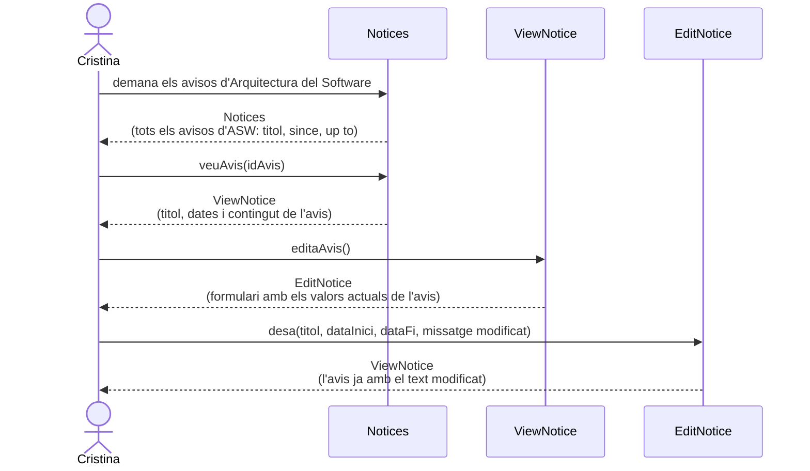
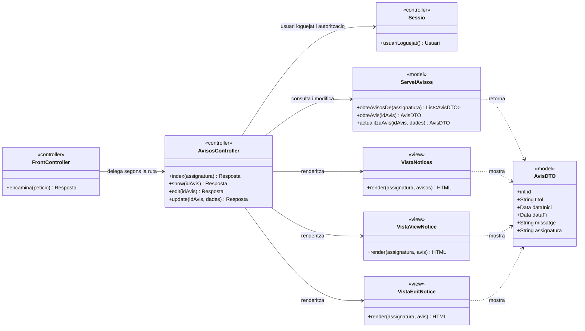
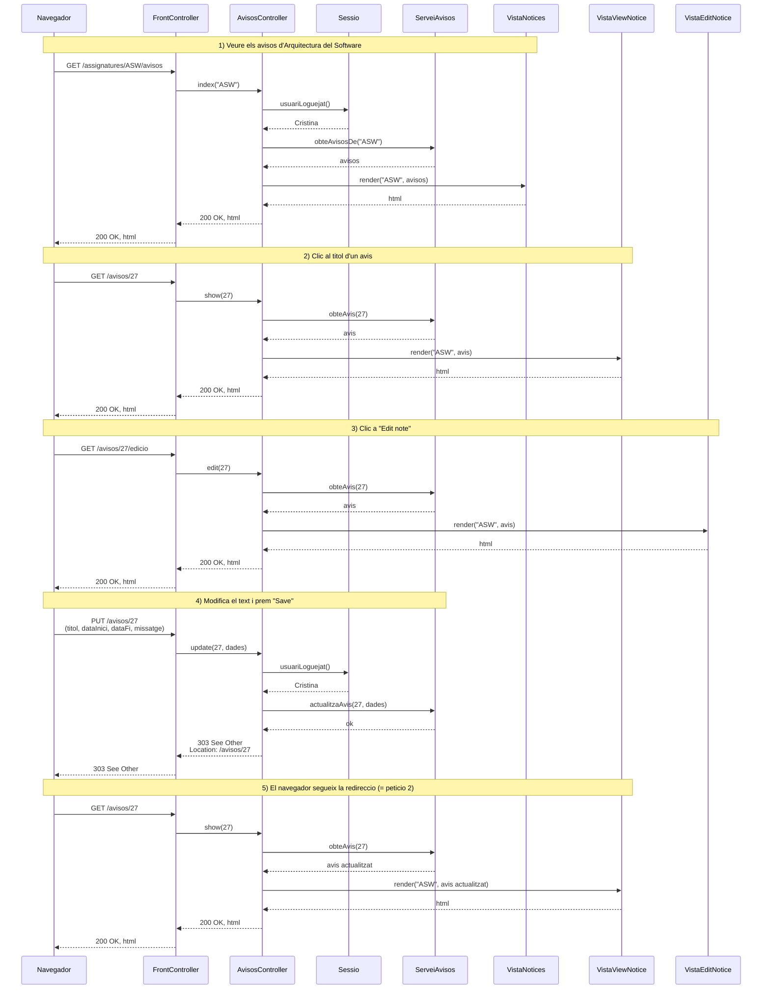

# Solució — Exercici 4.1 (Racó de la FIB: avisos d'una assignatura)

Enunciat original: [`Exercici 4.1.pdf`](Exercici%204.1.pdf)

Suposicions generals:

- La professora ja està loguejada i **ja ha escollit una assignatura concreta**.
  La sessió manté la seva identitat, però l'assignatura sí que cal que viatgi,
  perquè una professora en pot tenir més d'una.
- Cada avís té un **identificador intern** (`id`) que no es mostra però que
  viatja a les URLs i als formularis.
- Els tres botons de dalt de la llista (**"New note"**, **"New examination
  announcement"**, **"New library material"**) i l'**ordenació per columnes**
  (les fletxetes al costat de TITLE, SINCE i UP TO) surten a les captures però
  **no estan descrits a l'enunciat**, així que queden fora de l'abast.

Dues coses de l'enunciat que convé no "millorar" pel nostre compte, perquè és on
es perden punts copiant d'altres exercicis:

- **No hi ha pàgina de confirmació per eliminar.** L'enunciat diu que el sistema
  elimina i torna a mostrar la llista, punt. No hi posem cap screen `Confirma`.
- **No hi ha camí d'error a "Edit notice", ni botó "Cancel·la".** L'enunciat
  només diu què passa quan es clica "Save", i a la captura només hi ha aquest
  botó. La screen té **una sola operació**.

---

## a) [2 punts] Diagrama de flux de navegació (*screens and navigational paths*)

### Diagrama

`Notices` és la pantalla inicial. Fixeu-vos en dues coses:

- De `EditNotice` només en surt **una fletxa**. És l'única screen del diagrama
  sense cap camí de tornada a ella mateixa, perquè l'enunciat no descriu cap cas
  d'error.
- `EditNotice` s'hi arriba **des de dues screens** diferents, però sempre se'n
  surt cap a `ViewNotice`. Això vol dir que després de desar **no tornes on
  eres**: si havies entrat des de la llista, acabes a la pàgina de l'avís.

### Contingut i operacions de cada screen

#### Screen `Notices`

Mostra tots els avisos de l'assignatura escollida.

**Informació que conté**

| Dada | Descripció |
| --- | --- |
| `assignatura` | Nom de l'assignatura, que encapçala la pàgina (p. ex. "WEB SERVICES") |
| `avisos` | Llistat de tots els avisos de l'assignatura |

De cada avís del llistat:

| Dada | Descripció |
| --- | --- |
| `id` | Identificador intern, no visible |
| `titol` | Títol de l'avís, que a més és un enllaç (columna TITLE) |
| `dataInici` | Data des de la qual és vigent (columna SINCE) |
| `dataFi` | Data fins a la qual és vigent (columna UP TO) |
| `seleccionat` | Estat del selector que hi ha a l'esquerra de cada fila |

**Operacions**

| Operació | Efecte |
| --- | --- |
| `veuAvis(idAvis)` | Va a `ViewNotice` amb el contingut d'aquell avís. **Dos clics diferents hi porten**: el títol de l'avís i el botó de l'ull a la columna ACTIONS. Són la mateixa operació |
| `editaAvis(idAvis)` | Botó del llapis. Va a `EditNotice` amb aquell avís |
| `eliminaAvis(idAvis)` | Botó de la paperera. Elimina aquell avís i torna a mostrar `Notices` |
| `eliminaSeleccionats(idsAvisos)` | Botó "Delete selected". Elimina tots els avisos marcats i torna a mostrar `Notices` |

#### Screen `ViewNotice`

Mostra el contingut sencer d'un avís.

**Informació que conté**

| Dada | Descripció |
| --- | --- |
| `assignatura` | Nom de l'assignatura |
| `id` | Identificador intern de l'avís, no visible |
| `titol` | Títol de l'avís |
| `dataPublicacio` | Data de publicació ("Published on ...") |
| `dataValidesa` | Data fins a la qual és vàlid ("Valid until ...") |
| `missatge` | Cos de l'avís |

**Operacions**

| Operació | Efecte |
| --- | --- |
| `editaAvis()` | Enllaç "Edit note". Va a `EditNotice` amb aquest avís |
| `eliminaAvis()` | Enllaç "Delete note". Elimina l'avís i va a `Notices` |
| `tornaALaLlista()` | Enllaç "Back to the list of notices of ...". Va a `Notices` sense canviar res |

#### Screen `EditNotice`

Formulari per modificar un avís.

**Informació que conté**

| Dada | Descripció |
| --- | --- |
| `assignatura` | Nom de l'assignatura |
| `id` | Identificador intern de l'avís, no visible |
| `titol` | Camp de text amb el títol actual (Title) |
| `dataInici` | Camp de data amb la data d'inici actual (From) |
| `dataFi` | Camp de data amb la data de fi actual (to) |
| `missatge` | Àrea de text amb el cos actual (Message) |

**Operacions**

| Operació | Efecte |
| --- | --- |
| `desa(dades)` | Botó "Save". Enregistra les dades i va a `ViewNotice` amb l'avís tal com ha quedat |

---

## b) [1 punt] Diagrama d'escenari d'interacció (*storyboard sequence*)

Escenari: la Cristina demana de veure els avisos d'**Arquitectura del Software**,
després vol veure el contingut d'un avís concret i finalment decideix editar-lo
per modificar-ne lleugerament el text.

Com que l'enunciat no descriu cap cas d'error a l'edició, l'escenari no té cap
bifurcació: és una línia recta de quatre passos.

---

## c) [2 punts] Diagrama de classes del disseny intern (capa de presentació, MVC)

Abast: només l'escenari de l'apartat b).

### Rutes implicades en l'escenari

| # | Petició HTTP | Controlador :: acció | Resultat |
| --- | --- | --- | --- |
| 1 | `GET /assignatures/ASW/avisos` | `AvisosController::index` | Renderitza `VistaNotices` |
| 2 | `GET /avisos/{id}` | `AvisosController::show` | Renderitza `VistaViewNotice` |
| 3 | `GET /avisos/{id}/edicio` | `AvisosController::edit` | Renderitza `VistaEditNotice` |
| 4 | `PUT /avisos/{id}` (cos: `titol`, `dataInici`, `dataFi`, `missatge`) | `AvisosController::update` | Desa i redirigeix (303) a la ruta 2 |

Notes de disseny:

- Les peticions 1, 2 i 3 són **segures** (només mostren informació): `GET`. La 4
  modifica un recurs existent: `PUT`. Com que els formularis HTML només envien
  `GET` i `POST`, a la pràctica es fa amb un `POST` i un camp ocult
  `_method=PUT` que el *front controller* interpreta.
- **L'assignatura només cal a la ruta 1.** A partir d'aquí l'`id` de l'avís ja
  el determina tot: un avís pertany a una assignatura, i el controlador la pot
  recuperar del mateix avís. Posar-la a totes les rutes seria informació
  redundant que a més caldria validar que és coherent.
- Després de desar s'aplica **POST/Redirect/GET**: es respon `303 See Other` cap
  a `GET /avisos/{id}`, de manera que recarregar la pàgina no torna a desar.
- **Cal comprovar l'autorització a cada petició**: que la professora loguejada
  pugui realment tocar els avisos d'aquella assignatura. Que la pàgina anterior
  no li oferís l'enllaç no vol dir res, perquè qualsevol pot escriure la URL a mà.

### Diagrama de classes

### Repartiment de responsabilitats MVC

- **Controlador** (`FrontController`, `AvisosController`): rep la petició HTTP,
  n'extreu els paràmetres (`assignatura`, `idAvis`, els camps del formulari),
  comprova que la professora loguejada hi tingui dret, decideix quina operació
  del model cal invocar i quina vista s'ha de renderitzar, o si cal redirigir.
  No conté lògica de negoci ni genera HTML.
- **Model** (`ServeiAvisos` i `AvisDTO`): és la **façana de la capa de domini**
  vista des de la presentació. Hi viuen les regles de negoci —validar que la
  data de fi no sigui anterior a la d'inici, per exemple— i és independent
  d'HTTP.
- **Vista** (`VistaNotices`, `VistaViewNotice`, `VistaEditNotice`): genera
  l'HTML a partir de les dades que li passa el controlador. És qui decideix
  formatar les dates, pintar el títol com a enllaç i dibuixar els tres botons
  d'ACTIONS de cada fila.

> **Fora de l'escenari b)** — per cobrir tota la funcionalitat de l'apartat a)
> caldria afegir al model `eliminaAvis(idAvis)` i `eliminaAvisos(idsAvisos)`, i
> al controlador `destroy` sobre `DELETE /avisos/{id}` (botó de la paperera i
> enllaç "Delete note") i `destroyMolts` sobre `DELETE /assignatures/{a}/avisos`
> amb els `ids` al cos (botó "Delete selected"). Totes dues accions redirigeixen
> a la ruta 1.

---

## d) [2 punts] Diagrama de seqüència del disseny intern (capa de presentació)

Escenari de l'apartat b). Quatre peticions HTTP; l'última acaba amb una
redirecció que en provoca una cinquena, idèntica a la segona.

### Observacions

- **POST/Redirect/GET**: la petició 4 no renderitza cap vista; respon amb
  `303 See Other`. Així una recàrrega no torna a desar l'avís, i la URL on acaba
  la professora (`/avisos/27`) és compartible i marcable.
- **Les peticions 2 i 3 fan exactament la mateixa crida al model**
  (`obteAvis(27)`) i canvien només de vista. És normal i és el que fa evident
  que la diferència entre "veure" i "editar" viu **només a la capa de
  presentació**: el domini no sap què n'estem fent, d'aquell avís.
- **On aniria la validació.** L'enunciat no descriu cap error, però si n'hi
  hagués (una data de fi anterior a la d'inici, un títol buit), qui ho hauria de
  detectar és `ServeiAvisos.actualitzaAvis`, perquè és una regla de negoci. El
  controlador captaria l'excepció i renderitzaria `VistaEditNotice` amb el
  missatge, sense redirigir.
